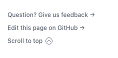

# Installation
### 설치
#### 기본 설치
참조: https://nextra.site/docs/docs-theme/start  
공식문서가 잘 되어있지만 내 입맛에 맞게 몇 가지를 변경도 하고 추가도 하였다.

```sh
mkdir nextra-blog
cd nextra-blog
```

`package.json` 생성
```json title:package.json
{
	"name": "nextra-blog", 
	"private": true
}
```

```
pnpm add next react react-dom nextra nextra-theme-docs
```

신기하게 Next.js 최신버전이 안 깔리고 Nextra에 맞는 버전이 설치된다. 확인  
```json title:package.json
{
  "name": "nextra-blog",
  "private": true,
  "dependencies": {
    "next": "^14.2.10",
    "nextra": "^2.13.4",
    "nextra-theme-docs": "^2.13.4",
    "react": "^18.3.1",
    "react-dom": "^18.3.1"
  }
}
```

다음 script도 `package.json`에 추가  
package.json
```json title:package.json
"scripts": {
  "dev": "next",
  "build": "next build",
  "start": "next start"
},
```

#### Next config
`next.config.js`파일 생성 
```js title:next.config.js
const path = require("path");

const withNextra = require("nextra")({
	theme: "nextra-theme-docs",
	themeConfig: "./theme.config.jsx",
});

const nextConfig = {
	images: {
		unoptimized: true,
	},
	output: 'export',
	reactStrictMode: false,
};

module.exports = {
	...withNextra(),
	...nextConfig,
};

```

output: 'export'는 Github Actions에서 정적인 파일 놓을 위치 지정을 위함  

#### theme config
`theme.config.jsx`생성  
블로그 글 오른쪽에   

이런 것들은 지우고 싶으면 다음과 같은 코드 추가.  
그리고 마지막 업데이트 날짜도 글에 나오게 하고 싶으면 코드 추가.  

단지 글이 있는 폴더와 분리시키기 위해 public 폴더를 만들고, 내 logo.svg 이미지를 저장

```jsx title:theme.config.jsx ln:true
import { useConfig } from "nextra-theme-docs";
import Image from "next/image";
import logo from "./public/logo.svg";

export default {
  logo: <Image src={logo} alt="my logo" width={160} />,
  //project: {
  //  link: "https://github.com/shuding/nextra",
  //},
  // ... other theme options
  feedback: {
    content: null,
  },
  editLink: {
    component: null,
  },
  footer: {
    component: null,
  },
  navigation: false,
  gitTimestamp: () => {
    const { frontMatter } = useConfig();
    return (
      <div>
        {/* 한 줄 띄기 */}
        Last updated on: {frontMatter.date}
      </div>
    );
  },
};
```

위 코드 24번째 줄 모든 글 마지막에 update 날짜가 frontmatter의 date 값을 읽는데, git commit을 하기전까지는 `pnpm dev`를 해도 나오지 않으니 당분간 안 나와도 무시.  

#### Typescript 설치 (optional)
내 개인 취향상 나중에 typescript을 이용해 코딩할 일이 생길 지 모르니 typescript도 설치  
간단하게 `pages/index.tsx`을 만들고  
```tsx title:index.tsx ln:true
import React from "react";

const Home = () => {
  return <div>Home</div>;
};

export default Home;
```
`pnpm dev`를 실행하면  

`next-env.d.ts`와 `tsconfig.json` 파일이 자동으로 생성되고  
`package.json`에 다음 줄이 자동으로 추가된다.  
```json title:package.json ln:16
  "devDependencies": {
    "@types/node": "22.5.5",
    "typescript": "5.6.2"
  }
```

이제 생성했던 `index.tsx`을 삭제한다.  
  
나중에 경로를 `@/`로 지정해놓는 syntax를 쓰기 위해   
`tsconfig.json`에 다음 코드 추가  
```json title:tsconfig.json ln:13
{
  "compilerOptions": {
    "paths": {
      "@/*": ["./*"]
    }
  },
```

테스트를 위해 `theme.config.jsx`에 4번째 줄 코드를  
```jsx ln:4
import logo from "@/public/logo.svg";
```
로 변경 → 사실 best practice는 아니다.  
  
#### 추가 설정
`pages/index.md` 생성  
```md
# Welcome to Nextra 

Hello, world!
```

`.gitignore`생성  
```
# next.js
/.next/

# dependencies
/node_modules
pnpm-lock.yaml
package-lock.json
yarn.lock

# output
/out/

# obsidian
.obsidian/
.trash/
assets/
```

`pages` 폴더를 Obsidian Vault로 연다  

```sh
git init
git remote add origin https://github.com/yunjaekim00/yunjaekim00.github.io.git
# 확인
git remote -v
```

`pages/IT-etc/blog/blog-as-a-code.md` 생성 → 글 작성  
frontmatter  
```md
---
title: "Blog as a Code"
date: "2024-08-05"
---
```

`title`이라는 front matter는 아래처럼 사이드바에 보여지는 제목만을 변경해준다.  


`pages/_meta.json`생성 → Sidebar 순서  
```json
{
  "index": {
    "title": "Welcome",
    "theme": {
      "layout": "full"
    }
  },
  "---": {
    "type": "separator"
  },
  "IT-etc": {
    "title": "IT 잡다"
  }
}
```

`_meta.json`에 명시하지 않은 폴더도 알파벳 순서대로 자동으로 뒤에 붙게된다. 순서를 명시하고 싶을 때만 사용하면 된다.

실행
```sh
pnpm dev
```

#### Github Actions
Github에 Repo 이름은 자신의 `[id].github.io`라는 제목으로 public repo로 만든다.

Github Actions 배포를 위해 root 폴더에 다음과 같이 폴더와 파일을 생성
```sh
.github
└── workflows
    ├── publish.yml
    └── setup-node
        └── action.yml
```

`action.yml`파일
```sh title:action.yml ln:true
name: setup-node
description: "Setup Node.js and install dependencies"
runs:
  using: "composite"
  steps:
    - name: Setup Node.js
      uses: actions/setup-node@v4
      with:
        node-version: 20

    - name: Check for pnpm
      shell: bash
      run: |
        if ! command -v pnpm > /dev/null; then
          npm install -g pnpm
        else
          echo "pnpm is already installed"
        fi

    - name: Install dependencies
      shell: bash
      run: pnpm install
```

`publish.yml`파일


```sh
git add .
git commit -m '1st commit'
git push origin main
```

